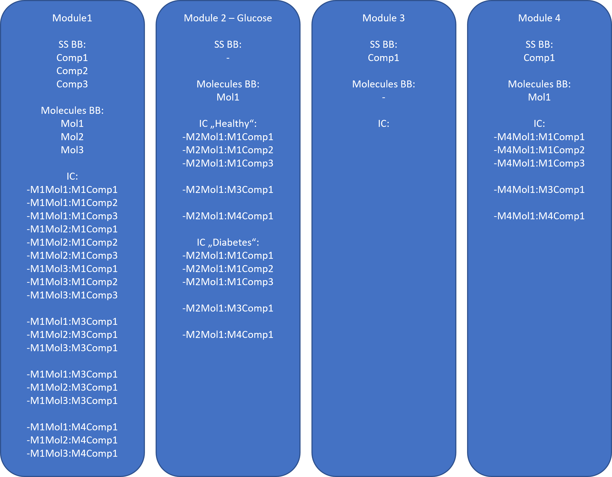

## Initial Conditions (IC) Building Block (BB)
- An IC BB is an $n \times m$ matrix with $n$ the number of molecules and $m$ the number of containers, consisting of molecule names, container paths, start values, Scale Divisors, and the "is present" and "negative values allowed" properties
- Values can be edited by user, new entries can be added or existing entries removed
- "Export to pkml": stores a pkml with all required information.
- Load from pkml as a new IC-BB
- Merge from PKML into exisiting IC BB
- Export to excel
- Load from excel

### Extend
- used for adding entries e.g. after adding new molecules
- shows a UI where user can select which entries to add
- shows all possible combinations of
  - molecules of the respective module and all containers across all modules. **ALTERNATIVE** - select a module (PK-Sim or xModule) and show combinations of molecules and containers of the two modules (the current module which IC will be extended and the selected module). Benefit of this solution - easy way to create IC entries for modules which only add containers but no molecules.
  - "Is present" property is pre-selected according to the default values for the containers

### Export from PK-Sim
- Does not include entries for proteins as there will be part of the "Experssion"-BBs.

### Use-cases and solutions
- Change IC values in and xModule
- Overwrite IC with formulas
- Different IC e.g. for different individuals or disease states. Example: a "Glucose" module. How to store different ICs?  We do not want to duplicate all the molecules and reactions etc. in a new module, only new ICs...
    - F2F 2021: Multiple IC and PV BBs per module
   
### Tasks
- Comparison
- Save to pkml
- Load from pkml

### Notes
