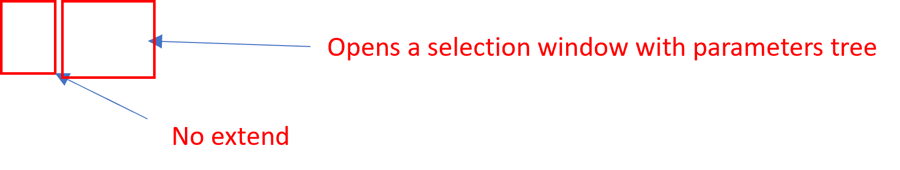
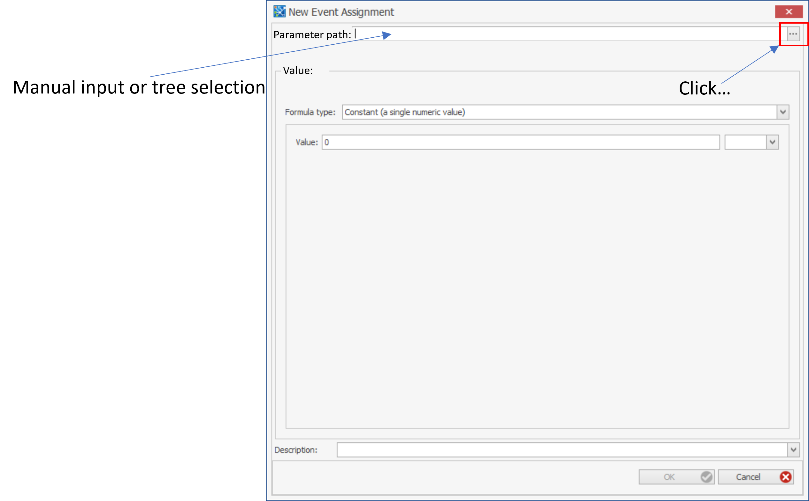

## Parameter Values (PB) Building Block (BB)
- A PV BB is a list of parameter paths/names and values
- Local and global parameters
- For "state variable" parameters, start values are listed (as currently in the PSV BB)
- By default, only values that are different from the default values in the respective BB are listed
- Values can be edited by user, new entries can be added or existing entries removed
- "Export to pkml": stores a pkml with all required information.
- Load from pkml as a new PV-BB
- Merge from PKML into exisiting PV BB
- Export to excel
- Load from excel
- The "Extend" function will not be available
- New entries can be added with a dialogue which allows to select from a tree (select Module -> BB and create a tree) or type in the path.

- Remove the column "Dimension"? Dimension is a property of the parameter in the repsective BB, why should the user be able to change it here?
- "Edit" that opens the same dialogue as "Add"? Should allow to edit the formula as in other parts of the software?
    - In the default view, only show the formula but do not allow to change/select it?

- Coloring for "Newly added values" and "Start value is modified" is unnecessary
- "Show only changed values" and "Show only new values" should be removed
- "Refresh from source" will be removed

### Export from PK-Sim
- Empty

### Use-cases and solutions
- Change parameter values in an xModule
- Overwrite parameter with formulas
   
### Tasks
- Comparison
- Save to pkml
- Load from pkml
- ...

### Notes
