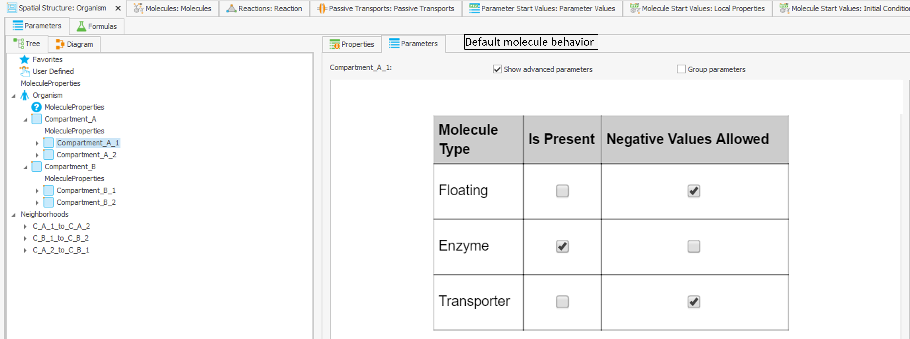
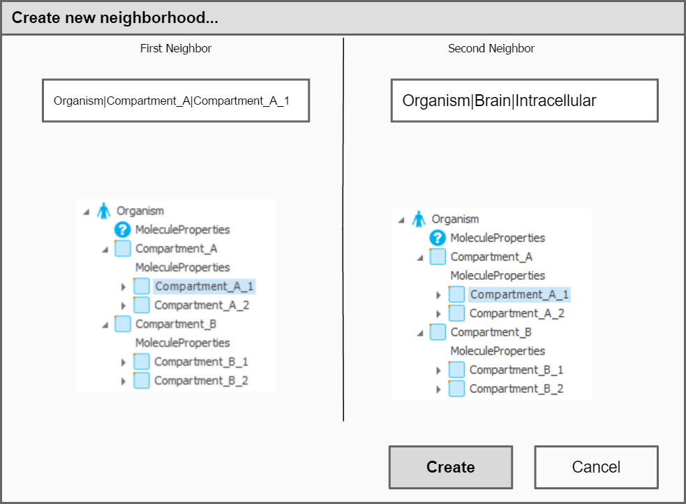

## Spatial Structures (SS) Building Block (BB)

Each SS defines default values of "isPresent" and "Negative values allowed" for certain types of molecules (floating compounds, enzymes, transporters) (selctable via a check-box). A SS BB within an extension module may contain containers that are _not connected_ with a common parent container. Example - a tumor organ and a kidney organ. Each top-level container within a sub-module ("Tumor" and "Kidney") **must** have a property "Parent container" (should we allow a list of parent containers, to allow integration of a new strucutre to multiple organs? allow wildcards?), which is the full path of the container in the hierarchy. During combination of the modules, containers will be placed as direct children of the specified parent container.

Parameters that are defined in the Individuals-BB be populated with "NaN"-values in the SS-BB of PK-Sim modules. 

### Neighborhoods
To allow replacement or addition of structures to the spatial structure (e.g., adding tumor, or replacing the kidney) within modules, the module has to come with the information about how the organ (or just some containers) are connected to the whole organism. Therefore:

- It should be possible to create neighborhoods by other means than drag-and-drop. E.g., a UI "Create neighborhood", where the user selects (or types in the full path to) the neighbors. In case of a tumor module, the user would select "PARENT|Tumor|Plasma" as one neighbor, and type in "Organism|VenousBlood|Plasma" as the second neighbor. the "PARENT" keyword is necessary as the path within the module is not complete. "PARENT" will be replaced by the container that is defined in the "Parent container" property.

A neighborhood is described by:
- Name
- ID
- Full path to the first neighbor
- Full path to the second neighbor
- Parameters
- Sub-container "MoleculeProperties"
  - Parameters

Each spatial structure BB within a module has a list of neighborhoods. Combining modules will overwrite neighborhoods with identical neighbors (i.e., matching of neighborhoods is performed by their neighbors and not by names). Deleting of neighborhoods is possible by defining them in the "Delete"-list of the SS BB.

Exporting of a container to a PKML also exports all its sub-containers and all neighborhoods that have this container or his sub-containers as a neighbor.

If an extension module defines a neighborhood with a neighbor that is not present in the model configuration, the model configuration is created and warnings are displayed ("WARNING: The neighborhood "Tumor_pls_Head_pls" was not created, as the neighbor "Organism|Head|Plasma" is not present!").

### Export from PK-Sim

### Use-cases and solutions

   
### Tasks

### Notes

### Parent path
The spatial structures (SS) of the models are organized in a hierarchy of containers, where each container can be a *child* of a *parent* container. At the same time, `Container A` can be a *child* of exactly one *parent container* `Container B` and the *parent* of multiple containers. Each container has a property `Parent path` which specifies the **full path** to its parent container.

In a module, the user can change the parent container property for the top level containers. When combining modules, the containers (and all their children) of the module will be placed under the container specified in the `Parent path` property. If the parent path of `Container A` is empty OR the container with the specified parent path is not found in the simulation, `Container A` will be created as the top-level container in the simulation.

Be cautios, as changing the parent path of a container will result in different absolute path to the repsective container and might break equations tha use absolute paths for variables definition. You might have to adjust the absolute paths accordingly, by manually appending the parent path to the alisases.