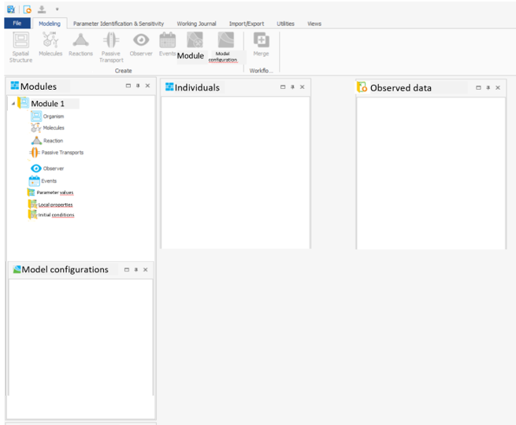
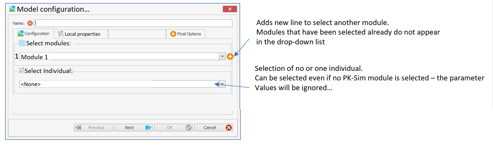
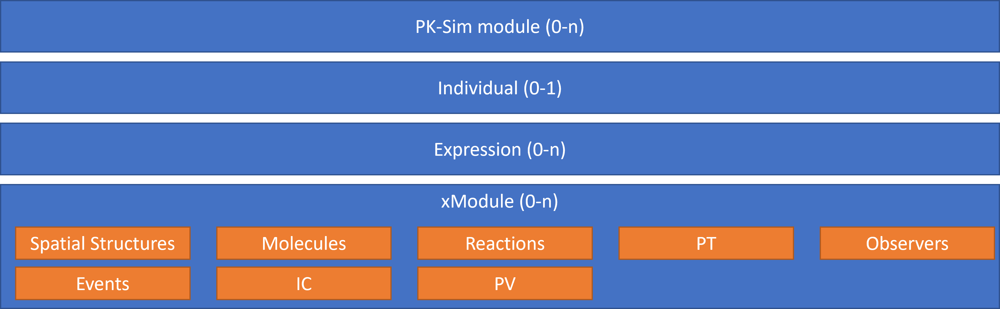

The following document specifies the new concept of organizing modeling projects in modules to achieve better flexibility and re-usability in MoBi.

The new concept introduces changes to the way how model structures are organized and combined to simulations. The current implementation of the software (OSPS V11.1) has two major layers of organization of a MoBi project – **Building Blocks** (BB) that are combined to **Simulations**. The proposed modularization concept extends the structure to Modules, Building Blocks, Model Configurations, and Simulations.

## Definitions:
- **Entity**: everything within the model structure - molecule, container, parameter, parameter value...
- **Building Block (BB)**: remains as in current OSPS logic - a summary of specific model parts.
- **Module**: A set of BB
  - _Extension module_: (xModule) Editable modules that can be combined with PK-Sim modules in a _Model Configuration_.
  - _PK-Sim module_: A module based on a PK-Sim model. Not editable by default and can be converted into an xModule.

- **PK-Sim snapshot**: part of the PK-Sim module allowing the re-creation of the this PK-Sim module.
- **Model configuration**: combination of modules.
- **Model**: An instance of a model configuration. Models from the same configuration may differ in their parametrization.
- **Simulation**: Combination of the **model** and the results of a simulation of this model.
- **Individual**: Parameter set describing the physiological properties of an individual. The parameter set referred to is limited to the parameters provided by PK-Sim (and, if extension of the SS require, some additional parameters).
- **MoBi-project**: A MoBi-file (e.g. *.mbp3) containing modules, model configurations, models, observed data, etc.
- [**Initial Conditions (IC) BB**](BuildingBlocks/InitialConditions-BB.md): formerly known as Molecular Start Values.
- [**Parameter Values (PV) BB**](BuildingBlocks/ParameterValues-BB.md): formerly known as Parameter Start Values.

## Project structure
A MoBi-project contains a set of:
- PK-Sim modules
- Extension modules
- Individual BBs
- Expression Profile BBs
- Model Configurations, which are combinations of (0-n) PK-Sim modules, (0-n) extension modules, (0-1) individual BB, and (0-n) expression profiles.
- Models resp. simulations, which are instances of model configurations.

## Modules
Every module consists of **building blocks (BB)**, with BB types *Spatial Structures (SS)* (1), *Molecules* (1), *Reactions* (1), *Passive Transports (PT)* (1), *Observers* (1), *Events* (1), *Parameter Values (PV)* (1-n), and *Initial conditions (IC)* (1-n). Every module inlcudes exactly one BB of each type. Empty BBs are allowed.

| Module BBs         | Comments                   |
| ------------------ | -------------------------- |
| Spatial Structure  | As it was before           |
| Molecules          | As it was before           |
| Reactions          | As it was before           |
| Passive Transports | As it was before           |
| Observers          | As it was before           |
| Events             | As it was before           |
| PV                 | defined above              |
| IC                 | defined above              |

## PK-Sim modules
A project in MoBi can be based on a PBPK model exported from PK-Sim. This model is present as a **PK-Sim module** and contains *all of the BB types*. PK-Sim modules cannot be edited by default. If the user decides to edit a PK-Sim module, the PK-Sim module will be converted to an extension module. A project can contain multiple or no PK-Sim modules. Every PK-Sim module will contain the *snapshot* of the PK-Sim model that will allow recreating of the model in PK-Sim.

It is possible to save the snapshot associated with a PK-Sim module (e.g. right-click "Save PK-Sim snapshot") so the model can be recreated in PK-Sim.

Export of a PK-Sim model to MoBi creates one PK-Sim module, one individual, and (0-n) expression profile BBs.

When converting a PK-Sim module into an extension module (i.e., making the PK-Sim module editable), the user has to select an Individual based on which the missing values will be filled out.

When viewing a SS BB of a PK-Sim module, one of the existing Individuals can be selected fron the drop-down list.

## Extension modules
Each MoBi project contains any number of **Extension modules**.

Each module containing molecules automatically contains default IC entries for these molecules in the PK-Sim module(s) or the combination of all PK-Sim modules with the SS BB within the module.

*Creation* of new modules can be performed from scratch ("Create new module" creates a module with empty BBs) or by copying whole modules ("Clone module") or parts of the modules (e.g., multi-select SS and reactions BB and select "Create new module from..."). It is furthermore possible to save modules (as pkml), or save BB and load them in modules.

An extension module can have multiple PV and IC BBs. If an xModule has mutliple IC BBs, they all have the same entries, only the values differ. This implies that extending one of the ICs also extends the others. Q: _Also synchronize the "isPresent" and "negative values allowed" properties?_

## Deletion of entities
An extension module does not only allow to _extend_ or _overwrite_ the entities of modules it is combined with (e.g., PK-Sim modules), but also to _delete_ certain parts present in other modules. This functionality will be implemented with **Deletion-Lists** as part of the BBs within the extension modules. A deletion-list holds full paths to the entities that will be deleted from the model structure. Every deletion is recursive, i.e., all children of an entity specified in the deletion-list will also be removed from the final structure.

The user can create entries either by typing the full path or by selecting them from a tree.

- For SS BB, containers or neighborhoods can be added to the list.
    - Tags? E.g. "Organism|Liver|TAGS|LiverTag"
- For molecules, molecules as such can be added to the list.
- For reactions, the reactions can be added to the list.
- For passive transports, either single PT, or
    - _Conditions_ of certain transports, e.g., `"DrugAbsorption_para|SOURCE|Lumen"`, `"DrugAbsorption_para|TARGET|Mucosa"`, `"DrugAbsorption_para|INCLUDE|Glucose"`, `"DrugAbsorption_para|EXCLUDE|Insulin"`. If these entries are added to the "Remove"-list, the respective conditions will be removed from the existing transports.
    - Similarly, for PT we could introduce the "Add"-list to add conditions
- For observers, the observerst themselves and the conditions similarly as for the PT
- For Events, full path to the container that should be removed.
- No "Delete" for IC and PV
- No "Delete" for the "Individuals"- and "Expression Profiles"-BB.

In case an entry defined in the "Delete"-list is not found, the model configuration should be created and a warning generated.

## Model configuration

Specific combination of modules is called **model configuration**. Upon building the model configuration, the extension modules will *extend* or *overwrite* the selected PK-Sim modules. The user is allowed to select multiple PK-Sim modules, or PK-Sim modules in combination with extension modules, or only the extension module(s). The number of modules selected is not limited. The selection of PK-Sim and extension modules results in an *hierarchy* of the modules within the build configuration. If multiple PK-Sim modules are selected, they all must be of the same version (11.1, 12, etc...) and structure (small molecules or large molecules). If the version or the structure differs, the user cannot create the model configuration.

Multple PK-Sim modules are always extended to a common PK-Sim module. Selected extension module 1 extends/overwrites the common PK-Sim module, selected extension module 2 overwrites/extends the combination of the common PK-Sim module and module 1, and so on. Internally, the software will create new BBs from the combination of the modules and create the models applying the current logic.

If a model configuration contains a PK-Sim module, the user must select an Individual (pre-select the first one?) and Expression Profiles (optionally). Individual and Expression Profiles can be selected without a PK-Sim module. In the hierarchy of the selected modules, the Individuals-BB always comes before the extension modules (i.e., the parameters are applied to the standard PK-Sim module). When an extension module is selected, the user must additionally select an IC and PV BB of that module.

The model configuration will potentially contain IC values that are not defined in the modules (e.g., a combination of a module with new molecules with a module with a new organ). These values are populated with default values (initial condition e.g. 0). The newly created BBs can be exported and re-imported as new modules, resulting in modules containg the intial conditions for these non-standard combinations.

Model configurations can be **configured** and **cloned**.

## Simulation
Simulations are created from model configurations. A single model configuration can have multiple models. All these models will have the same structure, but may differ in their parameters and/or initial conditions. During creation of a model from the model configuration, the user can select a different Individual and/or Expression Profile.

*Batch actions* such as "run all", "update all" will be available as an option in the context menu of model configuration.

## Combination rules
Three combination actions are supported:
- Extend
- Overwrite
- Delete

Combinations of BBs will be created by the following logic. Combining module A and module B:
1. For each entity in module B:
* If the entity is not present in module A, add the entity to the new combination (extend)
* If the entity is present in module A:
    * If the entity is a *quantity* (parameter, molecule initial condition, observer), instance from module B will be applied (overwrite)
    * If the entitiy is a *container* (organ, compartment), do nothing
2. Repeat 1. for each module as defined in the hierarchy of the selected modules
3. Create the final combination of the BBs as a model configuration.

Deletions are performed according to the hierarchy of the selected modules. I.e., if extension module 1 has an entry "Organism|Kidney" in the "Deletion"-list, and extension module 2 has a container "Organism|Kidney" (extended kidney), the final model configuration **will** have a kidney, because module 2 is applied after module 1.

Deletions will be applied first, i.e., if an xModule has "Organism|Kidney" in the "Deletion"-list and a Kidney organ in the SS BB, the Kidney will be replaced by a new verion.

MUST BE SPECIFIED FOR EACH BB TYPE

### Use cases
- Changing a tag of a container
- Changing conditions of passive transports
- Replacing a container
- Adding parameter to a container
- Changin a value or type of a parameter
- Adding new compartment to an organ
- Replacing an organ with a new structure

## Commit changes
STILL UNDER DISCUSSION

Commit to module will replace commit to BB. Only commiting changed values of parameters will be supported. The changed value will be propagated to the PV of the last module where the respective parameter is present. E.g., if Parameter A is present in Modules 4, 2, and any PK-Sim module (the number corresponds to the hierarchy selected during model configuration creation), the value will be propagated to Module 4. _Alternatively_: Show dialogue to select to which module the changes should be commited to.

## Administration protocols
MoBi should provide a wizard similar to that in PK-Sim to allow convenient creation of administration protocolls. ~~Combined with the **Generic modules** as described above, the administration protocolls could be stored as separate modules and applied repeatedly during model configuration creation. Only possible if _Alternative 2_ for generic modules is implemented.~~

## Individuals
See ["Individuals-BB"](BuildingBlocks/Individuals-BB.md).

## Protein Expression BB
See ["Expression Profile-BB"](BuildingBlocks/ExpressionProfile.md).

## PK-Sim model to MoBi Project
[Export Model to MoBi](WP2.1x_Export-PKSim-to-MoBi.md)

## Populations
Models can be exported to PK-Sim for population simulations.
