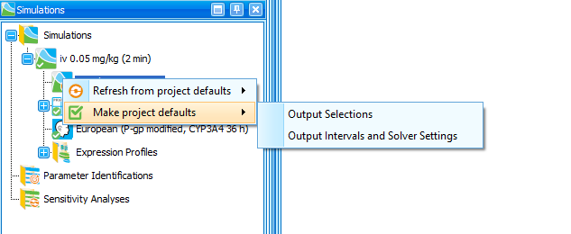
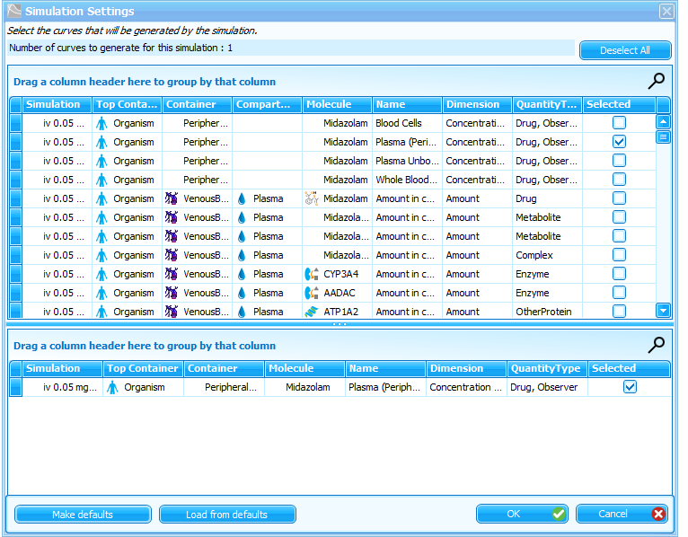
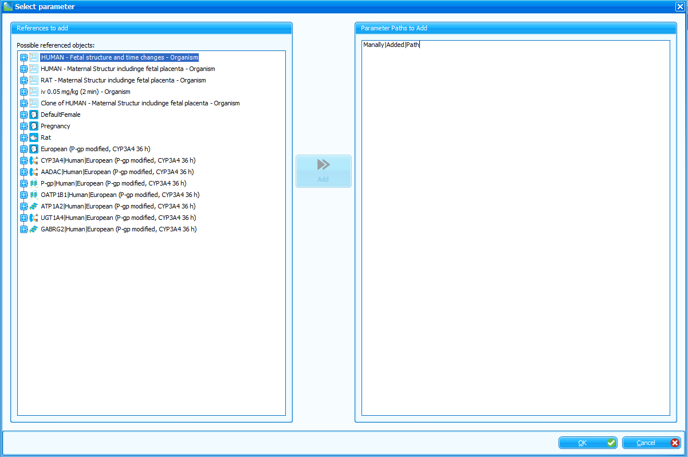

Further changes included in V12.

## Copy of container path 

It is possible to copy a path to a container from the simulations view:

## Export of container to .pkml

When exporting a container from a Spatial Structure to a .pkml, the user is asked to select an Individual and, optionally, Expression Profiles. In this case, species-specific parameters that are only present in the individual and not the default Spatial Structure of a PK-Sim module will be added to the exported container. This ensures that the exported container can be used without an individual.

When loading a container from *.pkml, the exported Expression Profiles are added as PV and IC.

## Commit to Building Blocks

Commiting differences between a simulation and the original BBs works for parameter values only, i.g., structural changes will not be commited. Changed parameter values will be commited to the PV BB of the last module in the simulation.

## Simulation settings

The "Simulations settings" building block has been removed in favor of the project-wide simulation settings. The project-wide simulation settings include the default output intervals, solver settings, and output selections. When creating a new simulationm default settings will be applied from the the project-wide settings.

Simulation settings from a simulation can be set as project-wide defaults, or can be applied from the defaults through the context menu of the "Simulation Settings" entry of a simulation:

Additionally, selection of the outputs can be set as defaults or loaded from defaults from the "Output Selection" dialog of a simulation:

If the user loads a simulation from *.pkml into an empty MoBi project, the user is asked if the settings stored in the *.pkml should be set as project defaults.

## Parameter Values BB

- New parameter values can be added by selecting entries from the parameters tree view, or by manually typing in the full path to the parameter in the "Parameters to Add" frame. Multiple entries can be added, whereby each parameter must be entered in a new line.

- It is possible to import values to an PV BB from another PV BB, individual, or expression profile exported as pkml.

## Initial Conditions

- It is possible to import values to an IC BB from another IC BB exported as pkml.