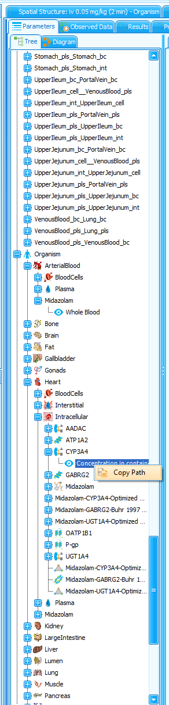
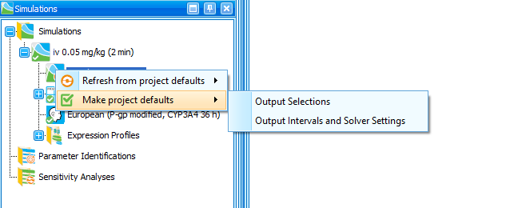
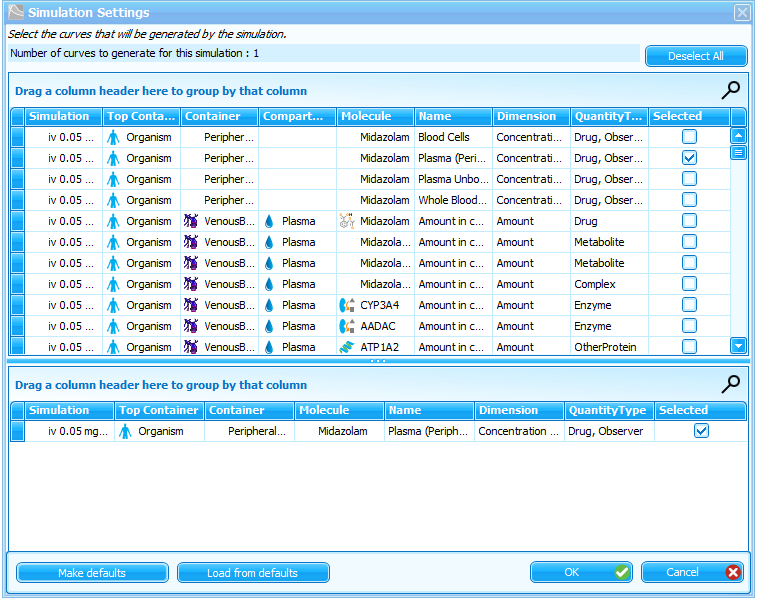

Further changes included in V12.

## Copy of container path 

It is possible to copy a path to a container from the simulations view:

## Simulation settings

The "Simulations settings" building block has been removed in favor of the project-wide simulation settings. The project-wide simulation settings include the default output intervals, solver settings, and output selections. When creating a new simulationm default settings will be applied from the the project-wide settings.

Simulation settings from a simulation can be set as project-wide defaults, or can be applied from the defaults through the context menu of the "Simulation Settings" entry of a simulation:

Additionally, selection of the outputs can be set as defaults or loaded from defaults from the "Output Selection" dialog of a simulation:

If the user loads a simulation from *.pkml into an empty MoBi project, the user is asked if the settings stored in the *.pkml should be set as project defaults.
