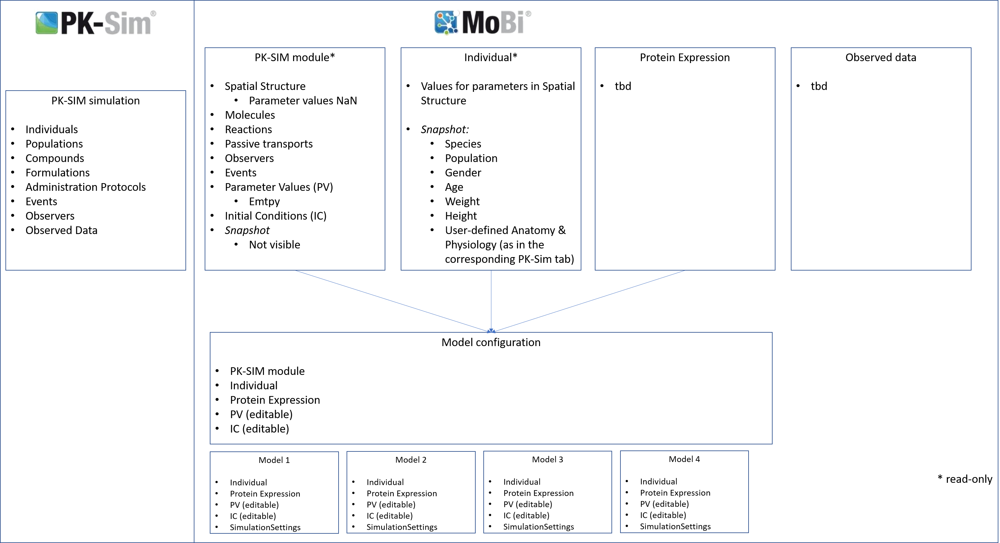

## PK-Sim model to MoBi Project
Tasks:
1. Translation (mapping?) of PK-Sim Model Structure to MoBi
- Define representation of structures of the different BBs in MoBi (use mockups)

A PK-Sim simulation transferred to MoBi will result in following structure:

